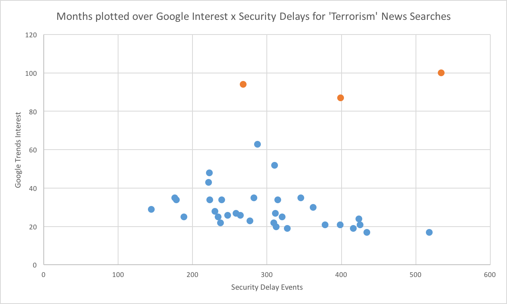
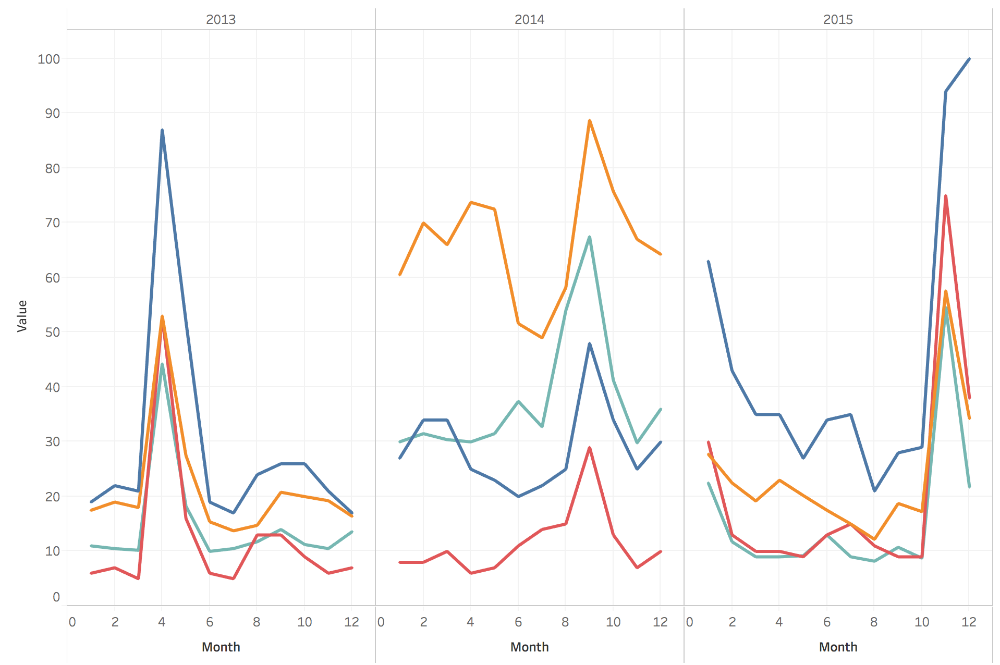

## Terror Trending and AiRline Security Delays Analysis

### about

The airline industry is rare for being impacted by virtually any global event, be it weather, fuel prices, labor organization, terrorism, etc. But is the mere _mention_ of terrorism (with or without a corresponding event) enough to cause tangible security-related delays at airports? Significant terror events have occurred in the last few years, and estimating its impact on security delays would be useful. Is “terror trending” a valid leading or trailing indicator of security-related air travel delays? My study sought to answer this question for U.S. domestic air travel between 2013-2015. (Sample visualizations shown on this page indicate the type of charts generated.)

### methods

Data on airline security delays was obtained from the Bureau of Transportation Statistics, while data on terror trending was obtained from Google Trends. Massive CSV files were cleaned and processed using custom Python scripts, and final visualizations were created using Tableau.

### results

There is little to no correlation between terror trending and security delays. A large terror shock, such as the three major ones observed between 2013-2015, will trigger security delays, but only if the event is of a certain magnitude.

