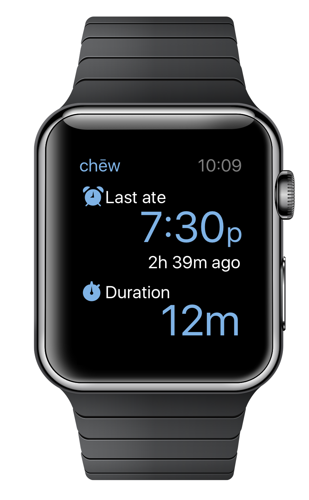
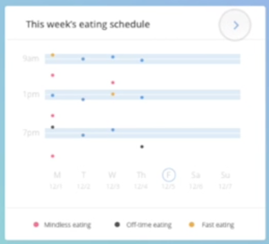

## Personal Informatics Prototype: "chew"

### The problem

Most Americans have unhealthy eating behaviors. ([See background and research](https://www.dropbox.com/s/02bbinp51bgncia/606-background-and-research.pdf?dl=0))

### Existing Approach

Current food tracking applications track calories and macronutrients -- which must be entered manually

### Our Solution

Focus on aspects where technology already supports passive tracking; areas we can already have an impact

### Enter chew

A passive tracker for your eating habits (for Apple Watch + iPhone platform)

It measures how long it takes you to eat, how fast you eat (by arm movement), and how frequently you eat -- seamlessly in the background.

The Watch app serves two key functions: sensing + information display. A minimal design focuses on just two key metrics.

### Our Technology

We would not start from scratch. We would utilize Apple's developer frameworks for Watch and iPhone, specifically "Core Motion" and "Watch Connectivity."

### Measurement approach

Superior to dual-band custom wearables or a necklace sensor. Arm-based detection can be trained to handle edge cases more easily.

Manual calibration by the user would be required for the first two weeks of use. This increases accuracy of measurement.

### Public Health Impact

chew would allow for wide-scale eating habit data collection for n>1 population studies. We could partner with academic institutions for research and clinical use.

<iframe src="//www.youtube.com/embed/3fivLqWNg_U?wmode=opaque&amp;enablejsapi=1" height="480" width="854" scrolling="no" frameborder="0" allowfullscreen></iframe>
