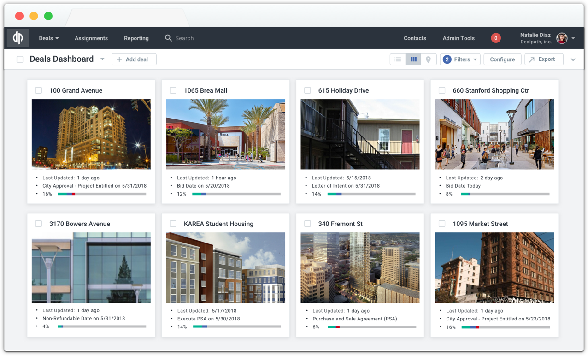
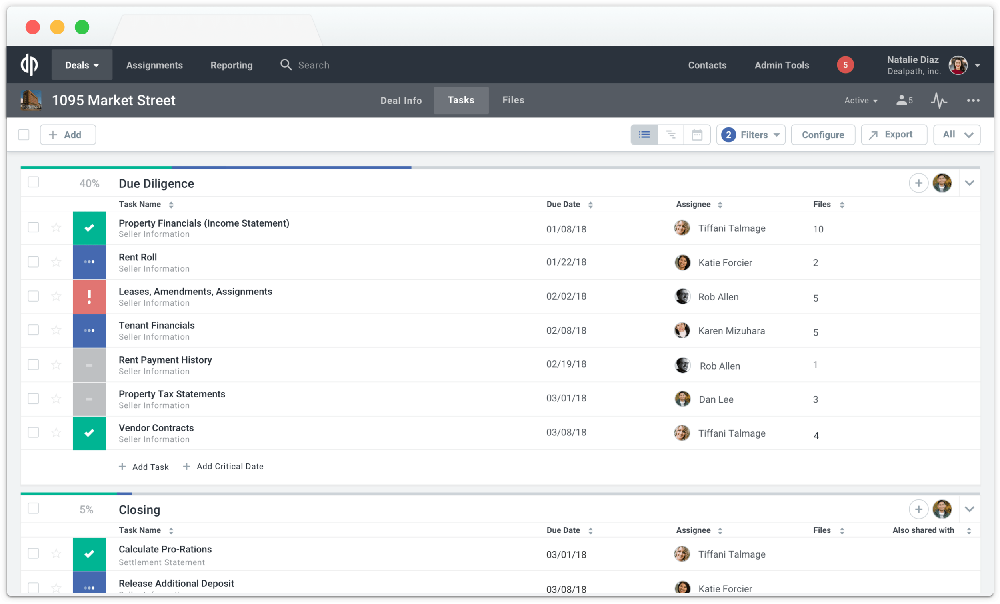
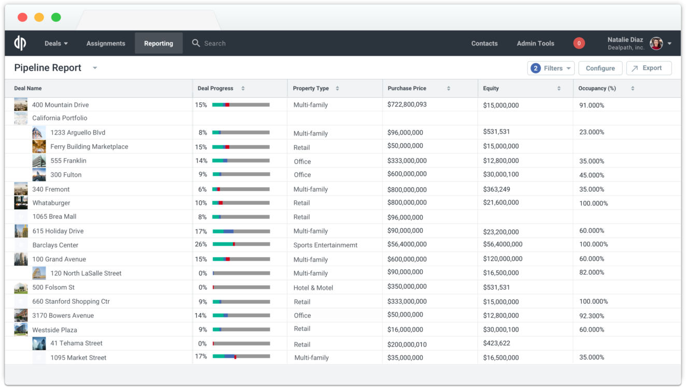
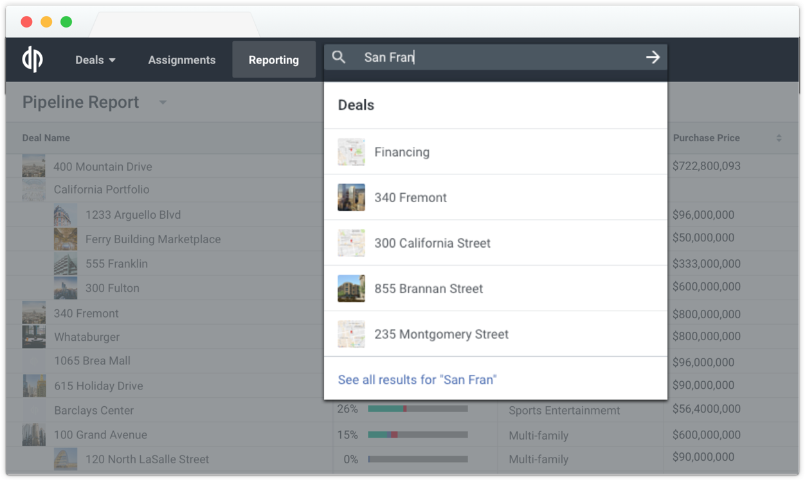

\[caption id="" align="alignnone" width="1276"\] Deals Dashboard \[/caption\]

## Dealpath

[Dealpath](https://www.dealpath.com/) is the real estate industry's leading cloud-based deal management platform. Investment and development teams leverage Dealpath as their command center for smart pipeline tracking, powerful deal analytics, and collaborative workflows to focus on value-add work that produces optimal risk-adjusted returns. Teams that use Dealpath experience a 25% increase in deals evaluated and a 50% boost in weekly productivity. The Dealpath platform is supporting over $10 trillion in transactions globally with leading institutions across the world.

The software has integrations to support a modern real estate tech stack, including: Compstak, Google Maps and Street View, ESRI, SSO through Okta, Microsoft, and Google, file storage with Box and Dropbox, Microsoft Excel, and more.

At Dealpath, I achieved the following:  
• Led product execution to drive company’s customer acquisition and retention strategy  
• Launched features across multiple product verticals, such as tools to chat about deals, edit files in-app, write notes, import data in bulk from CSVs and XLSs, print customizable PDFs from dashboards, send scheduled reporting emails, set repeating tasks, notify users of in-app updates, reply to notifications using email, and more  
• Partnered cross-functionally with design, engineering, customer success, marketing, and sales  
• Drove customer experience improvements to fuel growth in engagement, retention, and revenue  
• Met regularly with key customers to evangelize roadmap, build platform confidence, collect feedback, develop product strategy, and define success metrics

\[caption id="" align="alignnone" width="2500"\] Task Management \[/caption\]

\[caption id="" align="alignnone" width="1324"\] Reporting \[/caption\]

\[caption id="" align="alignnone" width="1252"\] Intelligent Search \[/caption\]
