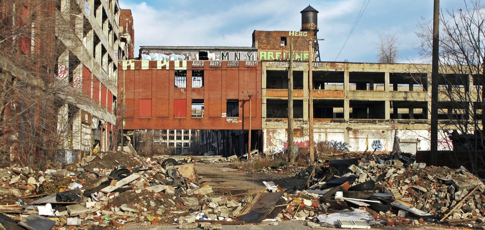
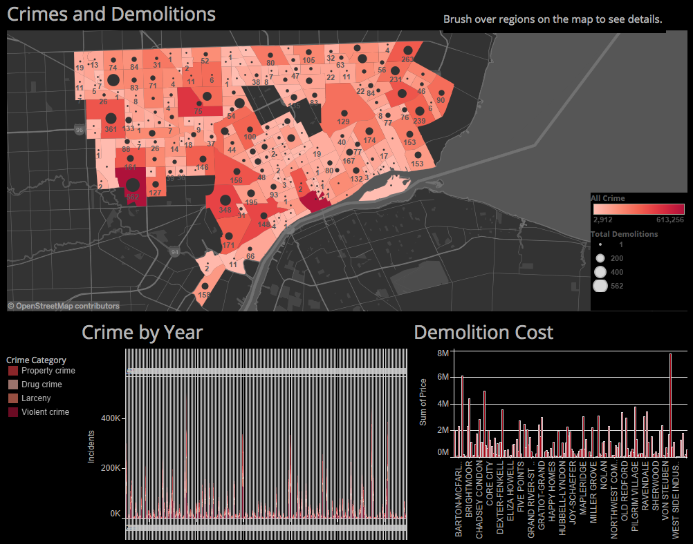
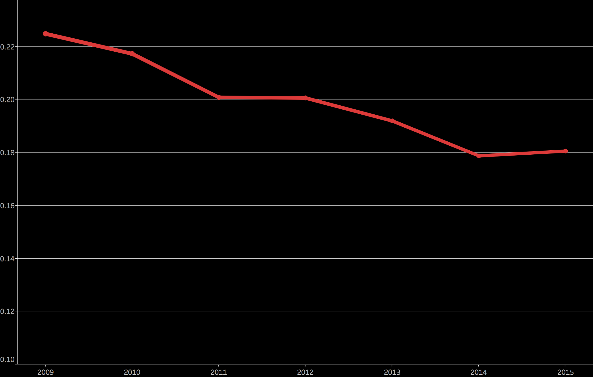
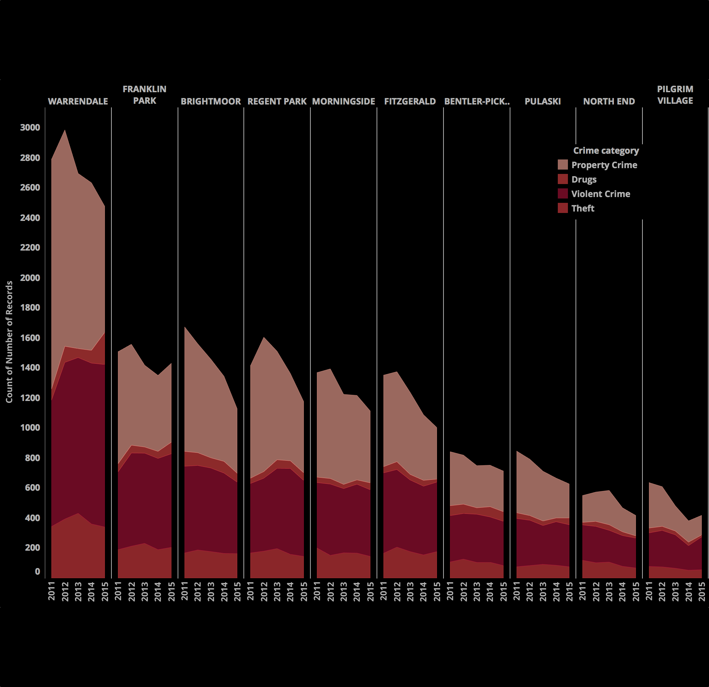

## Crime and Demolitions in Detroit: An Information Visualization Project

### methods

A massive data set of all crimes in Detroit from 2009 until present was obtained through the city's open data initiative. It was then cleaned and processed using a custom Python script. Visualizations and the final dashboard were created using Tableau.

### about

As part of an information visualization course, I was part of a team that created an interactive dashboard that allowed a user to explore the relationship between Detroit's crime rate and demolitions of abandoned structures.

IN RECENT years, large-scale demolition projects have been implemented in cities across the nation with the hopes that eliminating vacant buildings will help reduce crime and revitalize blighted communities. As described by Chicago's Police Chief Eddie Johnson, "These vacant buildings are targets for gangs to gather and commit nefarious activity, such as storing weapons or selling illegal drugs." Blight reduction efforts come with a significant cost to residents, with demolitions introducing health risks by releasing dust containing lead, heavy metals, and other toxic chemicals into the air.

Detroit, with a nearly 20% vacancy rate, has been targeted by the federal government for the most aggressive blight removal program in the nation. Since 2010, $761 million has been committed to the city and over eight thousand structures have been demolished.

### The project had a strategy

The logic revolved around targeting neighborhoods whose structures were so diffuse that it was difficult to provide essential city services, such as policing. The idea was that by demolishing these structures, the population would become concentrated, making it easier to provide those services. But most neighborhoods did not have a concomitant building replacement program to spur population concentration.

As reported in the Drawing Detroit: "After a building has been removed, there are limited investment incentives currently in place to encourage investors to redevelop these vacant parcels, leaving the city pocked with large swaths of vacant and open land between homes in some areas."

If the relationship between blight reduction programs and crime is true, we should observe a reduction in crime in Detroit due to this massive effort. We have conducted a systematic analysis of crime and demolition data in Detroit and have found that supporters of demolition projects may be overemphasizing their ability to reduce crime, and may not actually have an effect in high-crime neighborhoods.

### A hotbed of violent crime

As of 2015, Detroit had the second highest violent crime rate in the country with 1,760 violent crimes for every 100,000 city residents.

Detroit's crime rate is likely tied to the city's poor economic climate. Nearly 40% of Detroit's city residents live in poverty, and 12.4% of the workforce was unemployed in 2015, each the highest share of any major U.S city.

### Despite the high crime rate, crime per capita has been falling in Detroit for the past several years.

Crime is not distributed evenly throughout the city, certain neighborhoods are stronger pockets of crime. Our story focuses on these neighborhoods.

### A city in decline

Detroit has experienced a 60% reduction in population since the 1950. Roughly 20% of the city's structures are vacant. The city was hit especially hard by the Great Recession, its population plunging an additional 25% from 2000 to 2010.

The combination of large numbers of abandoned structures and high crime should make Detroit an ideal test case for the efficacy of demolition programs in crime reduction.

### High-crime neighborhoods were a target of the demolition effort.

While property crimes decreased markedly in the high-demolition/high-crime neighborhoods, violent crimes either increased or did not change at all.

Despite the questionable efficacy of the demolition program, costs continue to spiral. Detroit has taken down more than 10,000 homes under the effort since the spring of 2014. Demolition costs went from an average of about $13,600 per house in 2014, to about $16,400 in 2015.

And it is not just the monetary cost that must be taken into account. Demolitions place a heavy burden on residents in affected areas, introducing health risks by releasing dust containing lead, heavy metals, and other toxic chemicals into the air. In addition, removing a vacant structure does not ensure that a new structure will take it's place, leaving an expanse of vacant land between occupied parcels.

$160 million has already been spent, despite the program's questionable efficacy. As of October, 17 2016, Detroit's federally funded demolition program was suspended by the federal government. Under a city-funded program, it continues to demolish 25-30 structures per week.
