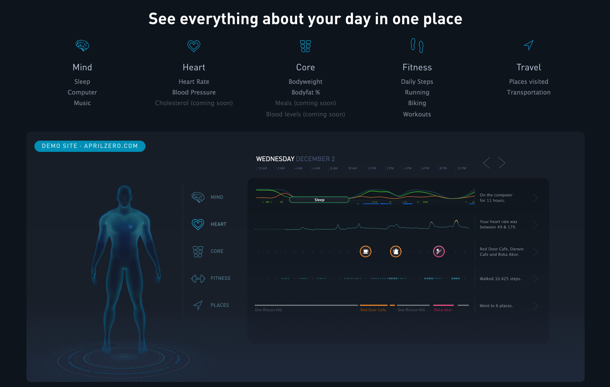

## Growth & Product @ gyroscope

I spent a summer working at the young startup Gyroscope, helping grow the user-base and assist in product roadmapping. I led content marketing efforts via user case studies and other subject-specific posts. I also helped handle customer support for both web and iOS platforms. I also performed market research and competitor analysis in the self-tracking/personal informatics market. I also gained exposure to the inner workings of a fully-featured [ReactNative-built](https://blog.gyrosco.pe/building-the-app-1dac1a97d253) product. Some of my user studies can be seen [here](https://blog.gyrosco.pe/tatiana-b68f863333f9), [here](https://blog.gyrosco.pe/cat-noone-6c8312a3b49), [here](https://blog.gyrosco.pe/ernesto-ramirez-f8fbecd2e807), and [here](https://blog.gyrosco.pe/dan-grant-8629d3cbf537).

