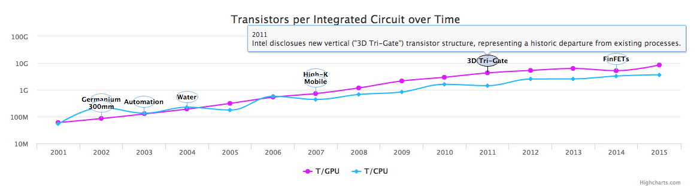

## Laws of Accelerating Change INTERACTIVE STORY

As part of an information visualization course, I created a page outlining the laws of accelerating technological change, using a series of interactive charts to tell the story.

Since the mid-20th Century, the pace of technological advancement has been exponentially increasing. These changes are encapsulated in a few "laws", most notable of which is Moore's Law (discussed below). These are observations or projections and not physical or natural laws. The trend of faster performance occurring simultaneously with decreasing cost have been the norm for decades now. They occur across a variety of electronic and biotechnological components and processes, a few of which are expanded upon in the sections below.

These advances impact one another in profound ways. For example, certain developments, like genomic sequencing, have come to rely on advancements in microelectronics such as computer processing, memory, and storage capacity. Genomic sequencing technology is a potent example of the application of advancements in microelectronics to an area with great impact on human health research. Otherwise, the purpose/impact of accelerating change in microelectronics becomes more abstract and harder to appreciate.

The site is divided into three sections that present various technologies with annotated timelines of either their performance or cost trend for the years 2001-2015. **Key milestones are flagged with annotated bubbles that can be hovered over to reveal their details.** You should by the end be able to recognize these milestones within the specific period of history of each presented technology, which together offer evidence for the existence of the "laws" of accelerating change. While many of the fundamental advances for these technologies were made in the decades prior to the 2000s, exact data from that time is harder to come by, and so the project is limited to 2001-2015.
