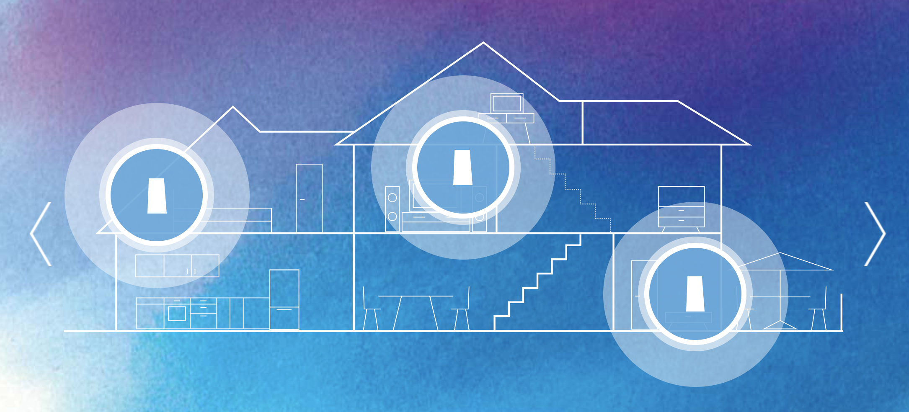
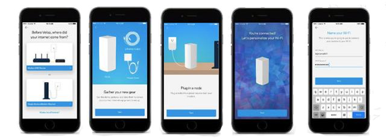

## Linksys Velop Mesh Wi-Fi System

The [Linksys Velop](https://www.linksys.com/us/velop/) Whole Home Mesh W-Fi system brings flawless, flexible, full-strength Wi-Fi to users homes, scaling up to at least 6,000 square feet. Users are guided through an intuitive app-based setup experience, and are then free to use one main network to roam freely about their home, without dropping and re-connecting. The [Linksys mobile app](https://www.linksys.com/us/linksys-app/) makes it easy to setup and remotely manage all Wi-Fi settings, including guest access, parental controls, device prioritization, and scheduling.  Velop also works with Amazon Alexa.

Velop has been crowned an [Editor's Choice award-winner](https://www.pcmag.com/roundup/350795/the-best-wi-fi-mesh-network-systems) by PC Magazine for home Wi-Fi systems in 2018, and was chosen by Apple to succeed its line of routers in the Apple Store. The New York Times [Wirecutter](https://thewirecutter.com/reviews/best-wi-fi-mesh-networking-kits/) calls Velop "a solid system that performs well—especially in multi-hop configurations."

At Linksys, I supported hardware and software through mixed-methods design research, applying qualitative and quantitative methods to uncover our users' needs, values, and behaviors. I served as the voice of our user — advocating for their experience when delivering findings and recommendations to a cross-functional product development group.

I managed a variety of research projects end-to-end, with methods including surveys, interviews, focus groups, data analytics, contextual inquiry, field studies, competitive analysis, card sorting and paper-prototype testing. I operated a full-scale usability lab and led weekly rapid, iterative usability testing and interviews to support agile design iteration, in addition to larger summative and benchmark testing. I also led an internal study on our company's software design and development process. Lastly, I helped roadmap the company's long-term UX Research agenda.

