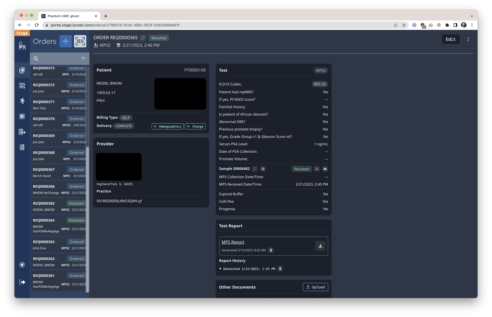
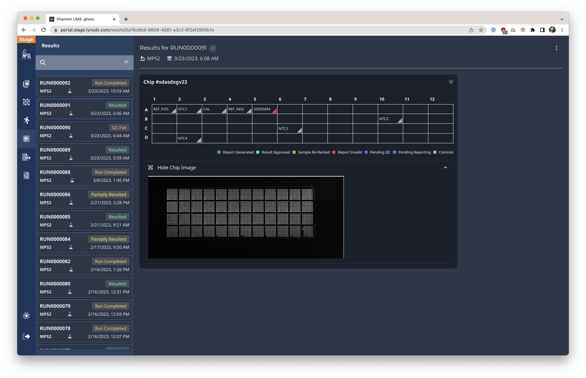
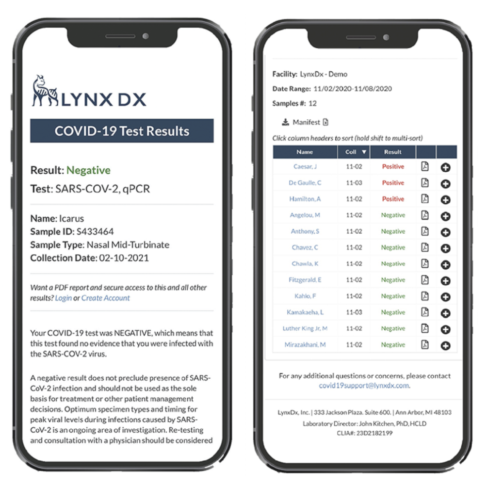
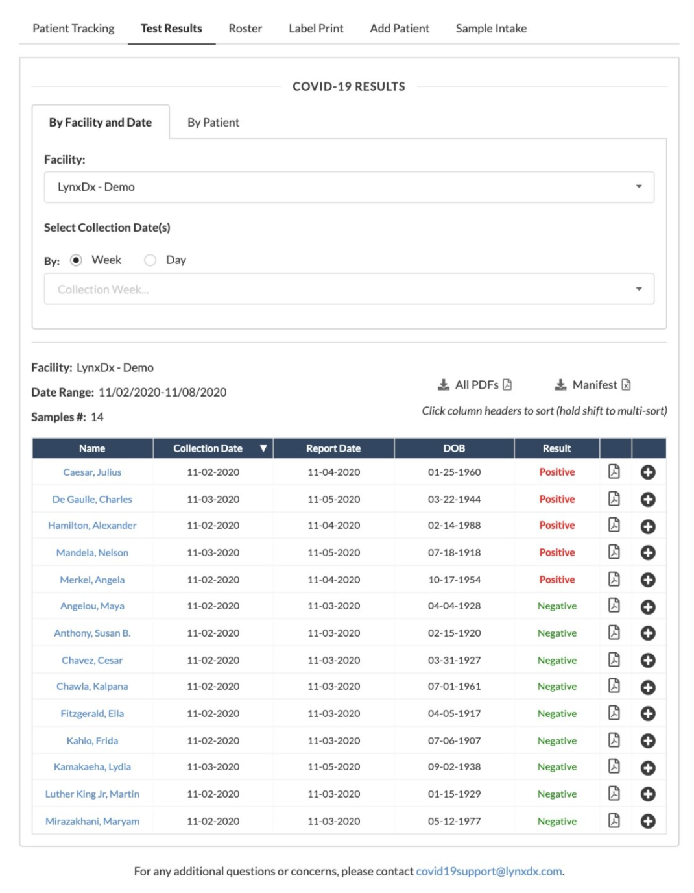
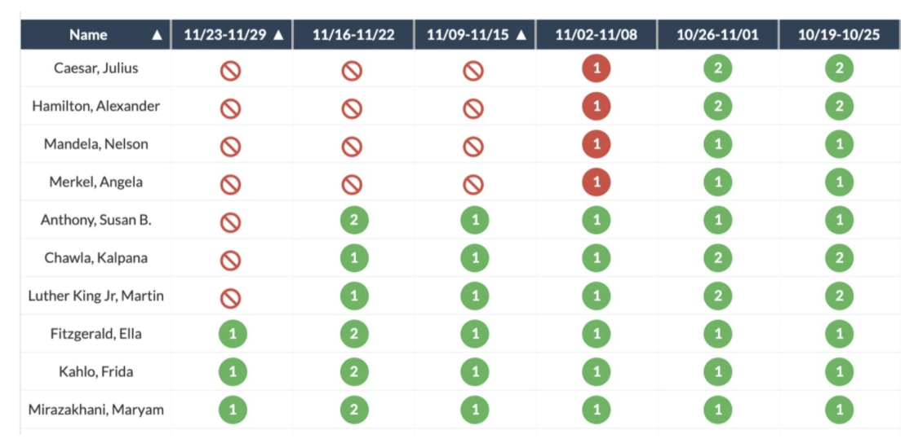

## LYNXDX

I served as Head of Product at LynxDx, a biotech startup where I oversaw the custom-built laboratory information management system (LIMS).

LynxDx was founded to commercialize a novel prostate cancer screening test, developed in a cutting-edge research lab at the University of Michigan. On the brink of expanding this test, the pandemic struck and efforts were re-focused to COVID PCR testing. Within a short time, our team adapted our lab infrastructure to begin wide-scale COVID testing.

At one point, LynxDx was the leading COVID testing lab in Michigan, running all tests for the University of Michigan, Trinity Health, Detroit Public Schools, skilled nursing facilities all across the state, and other partners.

The custom LIMS supported high-throughput operations, allowing the lab to quickly track and report on patients, samples, and results. We built innovative features custom-tailored to many use-cases: skilled nursing facilities, community drive-thru visitors, universities, and more.

At LynxDx, I achieved the following:  
• Defined product roadmap for custom laboratory software, scaling company from zero to 2.5 million COVID PCR tests  
• Led software product strategy and execution to grow total testing volume, and serve enterprise clients  
• Led cross-functional team of 8 software engineers and systems analysts to generate $100 million in revenue  
• Expanded into new market segments by defining software strategy and evangelizing it cross-functionally  
• Partnered with software/IT/data teams at universities, K-12 schools, and public health departments to sync COVID test data through electronic health record (EHR) integrations  
• Ensured regulatory, legal, and privacy compliance (HIPAA, CAP/CLIA, NIST) via software product documentation  
• Launched software features such as metrics dashboards, client portal, and shipment tracking to grow customer-base and increase customer satisfaction

\[caption id="" align="alignnone" width="3824"\] Orders UI for MyProstateScore Laboratory Information Management Software \[/caption\]

\[caption id="" align="alignnone" width="3824"\] Results UI for MyProstateScore Laboratory Information Management Software \[/caption\]

\[caption id="" align="alignnone" width="1004"\] COVID LIMS Consumer Mobile Results UI \[/caption\]

\[caption id="" align="alignnone" width="1070"\] COVID LIMS Facility Results Manifest UI \[/caption\]

\[caption id="" align="alignnone" width="1120"\] COVID LIMS Facility Weekly Tracking UI \[/caption\]
