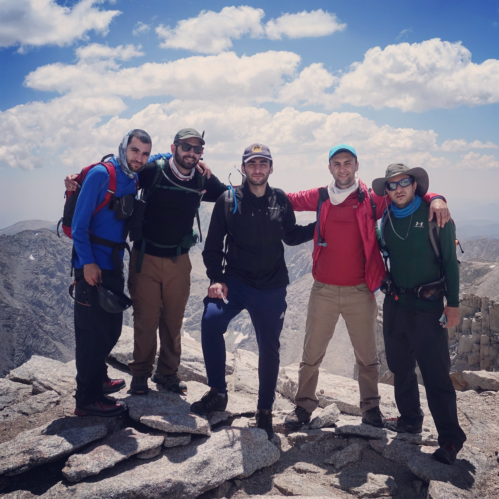

# **Notes on Mt. Whitney (2016)**

Requires training, planning, altitude acclimatization, etc., because it’s 22 miles total up and down, 6,500 ft. vertical each way

## To train for Mt. Whitney:

- Prepare by hiking 8-10 miles per week with 5000-6000 feet of elevation gain.
    
- Run 10-14 miles per week. 
    
- Focus on building leg strength.
    
- For 2 day climb: Be able to carry a ~40 lb pack
    
- Beginners should give themselves 12 weeks to get in condition, like the FitClimb 12 week Mountaineering Plan: http://www.fitclimb.com/page/12-week-mountaineering-fitness
    
- http://www.hikinggeek.com/2015/07/05/training-for-mt-whitney/
    
- Quality of the miles hiked is more important than quantity. If you need to prioritize your training time, steep shorter hikes are more beneficial than long hikes without much climbing.
    
- Here are a few benchmarks that can help you prepare for a summit attempt, in order of importance:
    
    - a hike with at least 5000 ft of elevation gain or a workout with 5000 ft of continuous climbing.
        
    - a hike that’s at least 15 miles long (20 miles is better)
        
    - a hike that takes 10+ hours to complete
        

For those that live in Southern California, a hike up San Gorgonio or San Bernardino can meet all three of these benchmarks. For others, meeting these benchmarks may be more difficult. Here is a suggestion from a man that lives in Atlanta, but hikes Whitney at least once per year:

> “I hit the gym about a week out and put in 6000 feet of gain on a treadmill set at 15 degrees, just to make sure my legs can handle it in one day. I’ve been hiking and climbing western mountains for about 10 years, and the biggest problem in training here in the east is the inability to get sustained gains in these low mountains. Your legs always get a downhill break after no more than 2000 feet, which is definitely not the case in the Sierras. The treadmill always tells me how ready I am.”

This can also be done on a stair climber, which may more closely mimic the act of hiking. Some googling shows that 100 flights is roughly equivalent to a 1000 ft of elevation gain. While benchmark #1 is about leg strength/conditioning, numbers 2 and 3 are helpful in preparing your feet for summit day. For those of us that sit at a desk all day, spending 14+ hours walking can be very painful. These long hikes will also prepare your body for carrying a pack for a long period of time. Reaching these benchmarks is not necessary – you may be able to summit without doing them and doing them doesn’t guarantee that you’ll summit. If you do the training necessary to reach them though, I do believe that your hike will be more enjoyable.

## List of Links/Resources 

- [https://www.youtube.com/watch?v=rdObK572xz4](https://www.youtube.com/watch?v=rdObK572xz4)
    
- [https://calitrails.com/2012/06/29/mount-whitney-dayhike-10000-calories/](https://calitrails.com/2012/06/29/mount-whitney-dayhike-10000-calories/)
    
- [http://indefinitelywild.gizmodo.com/how-to-climb-mt-whitney-1734598645](http://indefinitelywild.gizmodo.com/how-to-climb-mt-whitney-1734598645)
    
- [https://sites.google.com/site/mtwhitneytrailinfo/](https://sites.google.com/site/mtwhitneytrailinfo/)
    
- [http://www.sierramountaincenter.com/whitney.html](http://www.sierramountaincenter.com/whitney.html)
    
- [http://www.whitneyportalstore.com/forum/ubbthreads.php/ubb/cfrm](http://www.whitneyportalstore.com/forum/ubbthreads.php/ubb/cfrm)
    
    - ^ lots of good info here, up to date info on weather and trail conditions, etc
        
- [http://www.modernhiker.com/2012/04/25/mount-whitney-training-hikes/](http://www.modernhiker.com/2012/04/25/mount-whitney-training-hikes/)
    
- [http://en.wikipedia.org/wiki/Mount\_Whitney\_Trail](http://en.wikipedia.org/wiki/Mount_Whitney_Trail)
    
- [http://www.scaruffi.com/travel/whitney.html](http://www.scaruffi.com/travel/whitney.html)
    
- [http://indefinitelywild.gizmodo.com/how-to-climb-mt-whitney-1734598645](http://indefinitelywild.gizmodo.com/how-to-climb-mt-whitney-1734598645)
    
- [http://www.fitclimb.com/page/mt-whitney-conditioning](http://www.fitclimb.com/page/mt-whitney-conditioning)
    
- [http://www.dayhiker.com/directory/MtWhitney.htm](http://www.dayhiker.com/directory/MtWhitney.htm)
    
- [http://www.ghouse.com/daniel/whitney\_1996/index.html](http://www.ghouse.com/daniel/whitney_1996/index.html)
    
- [http://www.wsj.com/articles/SB122005156389884849](http://www.wsj.com/articles/SB122005156389884849)
    

## Gear/EQUIPMENT

- Hat/Bandanna
    
- Sunglasses
    
- T-Shirt – wool or synthetic (remember: “cotton kills!”)
    
- Shorts/Convertible Pants
    
- Gloves – merino wool or fleece or thin nylon spring skiing gloves
    
- Socks – thin synthetic liners and wool blend hiking socks (NO cotton!)
    
- Boots – some people do this hike in tennis shoes. that’s not recommended!
    
- Fleece/Sweater – you need a light, yet warm layer in case it gets cold (it will)
    
- Rain/GTX Shell – it can rain at any time here, plus wind is always a factor. A poncho can also work, but this doesn’t really stop wind
    
- Rain Pants – don’t go overboard on this item. These are really only for a downpour as occurs during the summer
    
- Backpack – bring a good pack
    
- Trekking Poles – helps a lot
    
- Water Bottles – however you transport water, you’ll need at least 3L from Trail Camp to the summit. Don’t skimp on this, you will/should drink it all
    
- Headlamp – you will need this for the pre-dawn hours, and for an emergency in case you are stuck above the trailhead after nightfall
    
- Water Treatment – you should definitely treat all your water on the Whitney trail. Use either an EPA-certified filter or treat your water with iodine tablets (don’t forget the neutralizing tablets) \[see “Life Straw” product\]
    
- Sunblock/Lip Balm – get the good stuff with a high SPF
    
- Toilet Paper / Wipes – when nature calls!
    
- Food & Snacks
    
- Oral rehydration Salts – Dehydration is way more common than people realize, and can lead to shock, kidney failure and even death. These salts are light and can be bought at most REIs or pharmacies
    
- Aspirin & Blister Treatment – you really don’t need a full blown first aid kit. But bring these two essential items.
    

## Trail Description (BY SEGMENT)

1. \*\***Whitney Portal**\*\*- Mile 0.0- 8,300’. The trail starts just below the Whitney Portal Store through a hallway of information signs. The trail ascends a number of long switchbacks passing Carillon Creek and the North Fork of Lone Pine Creek then continues to switchback & transverse the northerly wall of Lone Pine canyon. You then head into a forested area as you approach Lone Pine Lake.
    
2. \*\***Lone Pine Lake**\*\*- Mile 2.8- 10,000’. Shortly after the log crossing over  Lone Pine Creek, you will pass a sign for the turn off to Lone Pine Lake.  A permit is required beyond this point. After the fork to the lake, switchbacks take you up the westerly end of the canyon to the next level. The trail then skirts the south side of Big Horn Park on the way to Outpost Camp. 
    
3. \*\***Outpost Camp**\*\*- Mile 3.8- 10,300'' At the far end of Bighorn Park is a waterfall, a creek crossing, and Outpost Camp. After another creek crossing the trail then switchbacks up to the next level where you pass Mirror Lake. Above Mirror Lake the trail ascends above the tree line and transitions into a rock path. In this area the trail is more rugged as you gain elevation and pass by Trailside Meadow. As the trail switchbacks out of Trailside Meadow, Consultation lake comes into view.
    
4. \*\***Trail Camp**\*\*- Mile 6.0- 12,000'  The trail passes through Trail Camp, delineated by a rock boundary to the south and a small pond to the north. The stream feeding the Trail Camp Pond is the last easy area to get water before heading to the summit. After passing through Trail Camp you arrive at the 97-switchbacks. In the area of switchbacks 23-25 there is usually water flowing over the trail from a spring and snow melt higher up the slope. This area may be icy at times. After switchback #45 you will enter the area with the cable railing. This area may also be icy and can hold snow well into summer. After switchback #97 there is a long traverse (heading slightly down hill) over to Trail Crest.
    
5. \*\***Trail Crest- Mile**\*\* 8.2- 13,600'  The trail then travels to the west side of the crest as it descends to the John Muir Trail junction then starts to climb again and passes below Mt. Muir. After passing several windows, the next section of the trail goes up several switchbacks as you approach the ridge line and traverse north. The trail then bends and passes several rock columns and various drop-offs. After another bend you will enter the final section and see the summit in the distance. The trail traverses across to the base of the peak and then gradually ascends to the summit.
    
6. \*\***Mt. Whitney**\*\*- Mile 11.0- 14,497'
    

## Another DayHike Packing List

1. backpack
    
2. water (in bladder)
    
3. food and snacks
    
4. first aid kit/soft splint
    
5. emergency blanket
    
6. hand sanitizer
    
7. hat/beanie
    
8. gaiter
    
9. gloves
    
10. sunscreen with high SPF
     
11. windbreaker
     
12. blister defense (never had to use it thankfully)
     
13. bug repellent
     
14. headlamp (with extra batteries)
     
15. pen/paper
     
16. printed map just in case
     
17. cell phone + battery pack
     
18. water purifier - one can expect to drink 3-5 liters of water when climbing mt. whitney in a day. \[“LIfe Straw” is a good brand\]
     
19. TP/wipes
     
20. the permit
