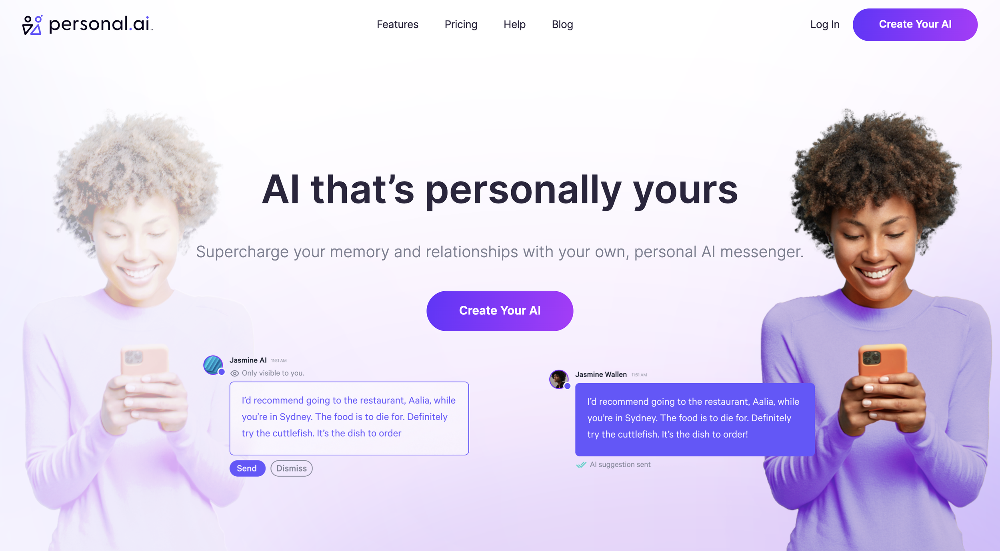

## Personal.ai

> _“Generic AI is theirs. Personal AI is yours.”_

Helped bring bespoke personal language models (PLMs) to market. These are “narrower” ML models users control, trained on their own personal data, rooted in their facts and opinions. It's an NLP API to the user, but with no code required. Users simply talk to train (or upload files). This enables countless interactions for consumers and businesses alike, from everyday messaging to enhancing memory to automating one's digital presence.

- Conducted technical diligence on new AI-based products and features
    
- Led early feature work for key integration with other messaging platforms like WhatsApp
    
- Developed mobile app user onboarding journey/flow
    
- Managed initial app store publishing process for new mobile app
    

