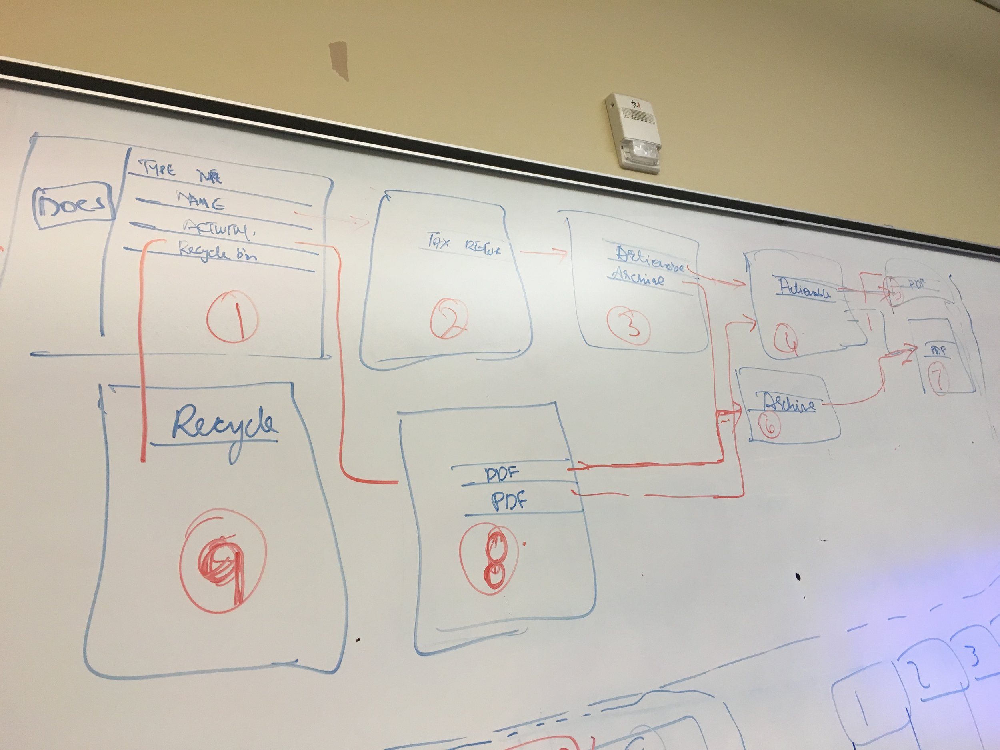

## Thomson Reuters Onvio: Usability/UX Study

[Thomson Reuters Onvio](https://tax.thomsonreuters.com/onvio/) is cloud-based software for tax and accounting professionals in the US, UK, and Canada. Our team was brought on to evaluate Onvio's client portal (where clients interface with their accountant) and recommend design solutions to improve usability and the overall user experience. Our methodology included interaction maps, comparative analysis, interviews, personas and scenarios, surveys, heuristic evaluation, and usability testing. **_Project deliverables are available upon request._**

