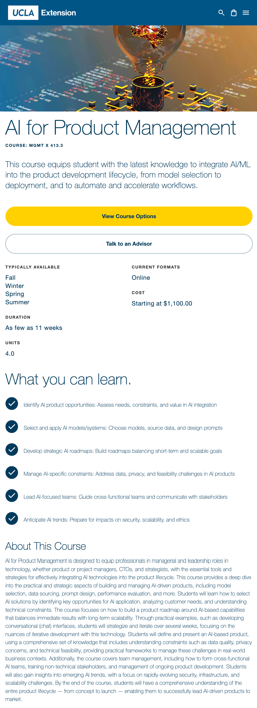
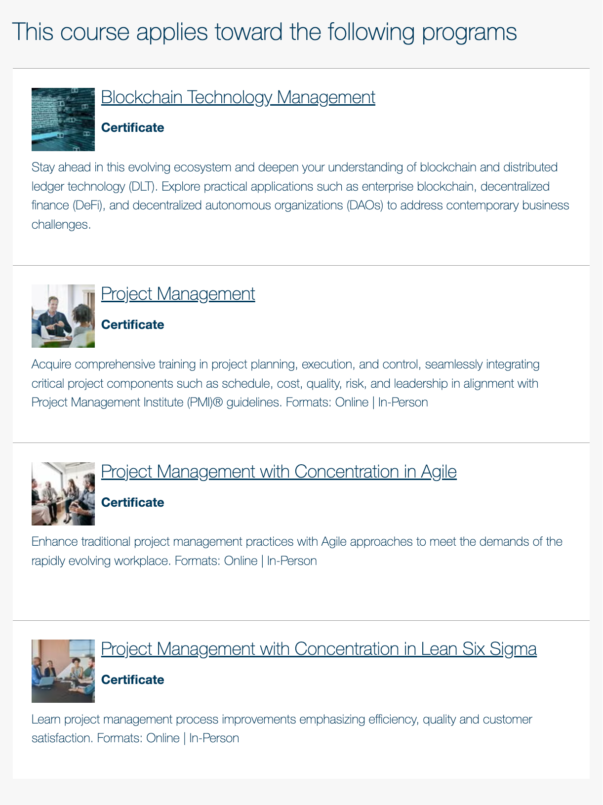
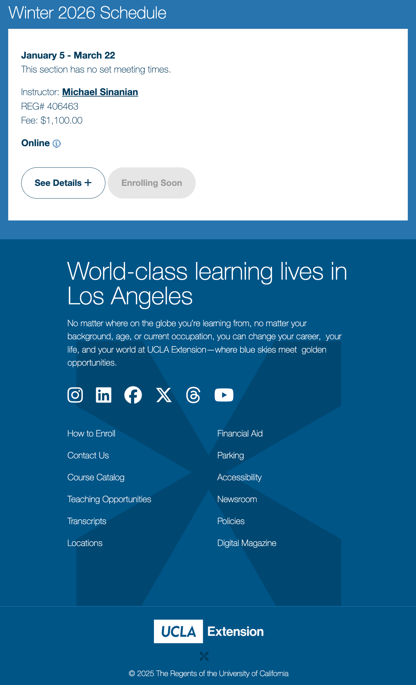

# UCLA’s “AI for PM”

Currently teaching UCLA’s [**“AI for Product Management”**](https://www.uclaextension.edu/engineering/machine-learning-ai/course/ai-product-management-mgmt-x-4133), a first-of-its-kind course at UCLA I developed in 2024 to help working professionals reskill/upskill through a new “AI PM” framework. I have continually taught it since the Winter’25 quarter, with student enrollment **growing 150% QoQ** throughout 2025, triggering course and section expansion for 2026. Through guiding students’ AI capstone projects, I help them bring AI solutions from class to their real-world employers (e.g. **Apple, Disney, NBCUniversal, Microsoft, Boeing, Northrop,** etc), resulting in **\>$20M/yr in downstream P&L impact**. I also advise UCLA Extension admins and fellow faculty on the new AI certificate curriculum, industry developments, and AI governance generally. My teaching work also includes delivering “AI for PM” public seminars, such as _“Spotting AI Opportunities: A Framework for Product Management”_. Samples and more information available upon request.

