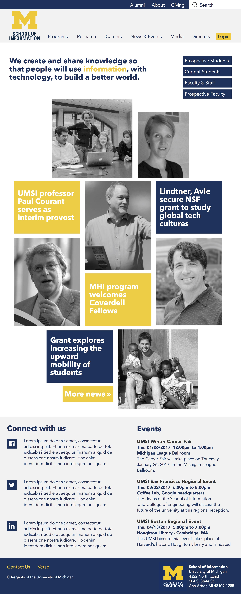
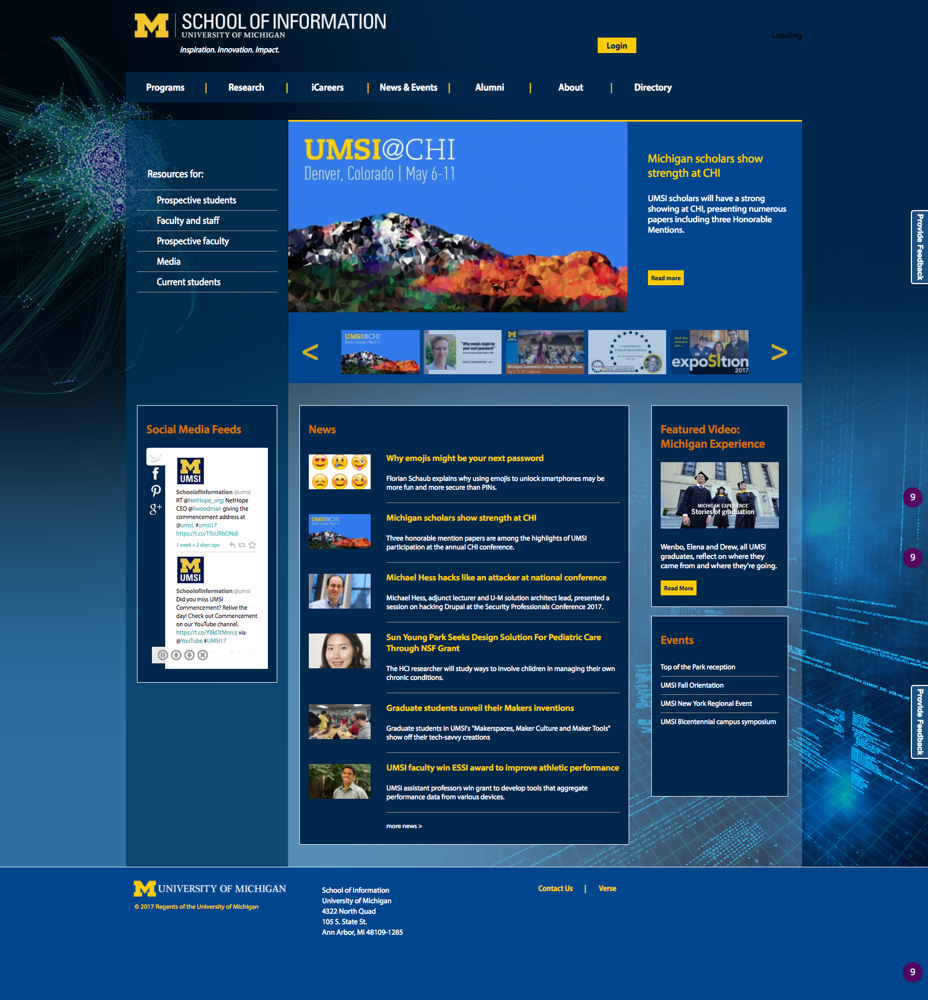
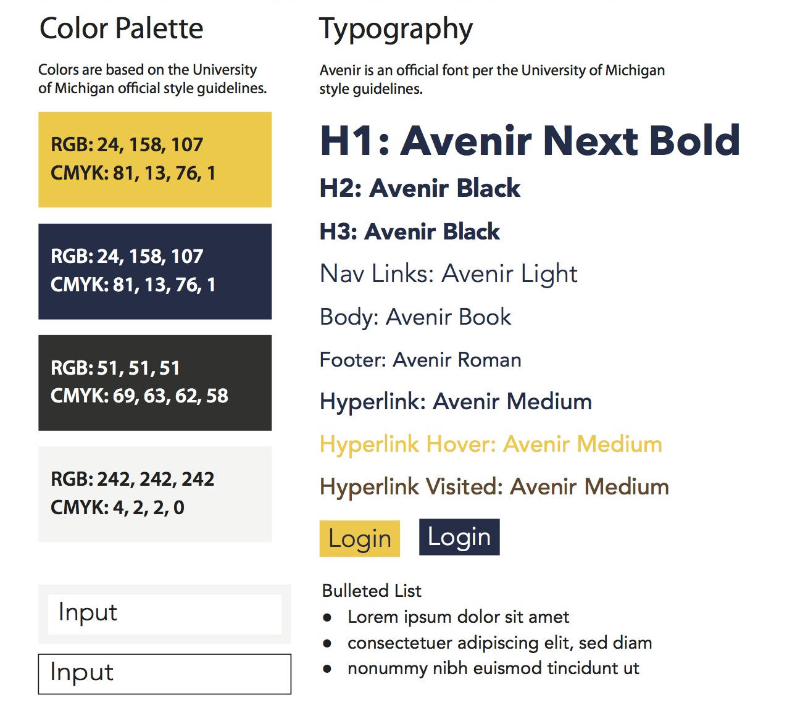

## Site Redesign Concept: UM School of Information

My redesign is based on a minimalist, broken-grid design with black and white images and square/rectangular geometry, which gives clarity, continuity, and unity. The imagery emphasizes people, which is the true asset of UMSI, and balances the austere minimalism with humanity. The page is designed to evoke a strong emotional response, with a Call to Action prompted by images and news in the main body. The emphasis is placed entirely in the middle, with the boxes highlighting the strengths of the school. The header/navigation area is split into two rows: one is a thinner row with secondary links (and unlike my peer review site, features a prominent direct link to the ‘Giving’ page). Social elements and a list of events are contained in the bottom, so as not to distract the purity and centrality of the main body boxes. The page is united by a grayscale and U of M color scheme.

