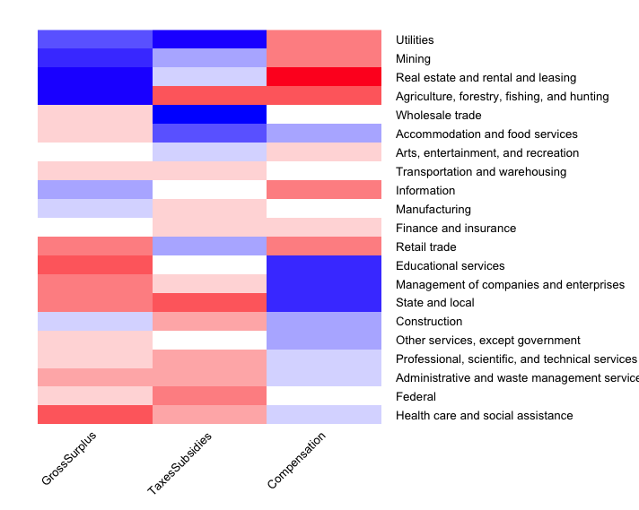
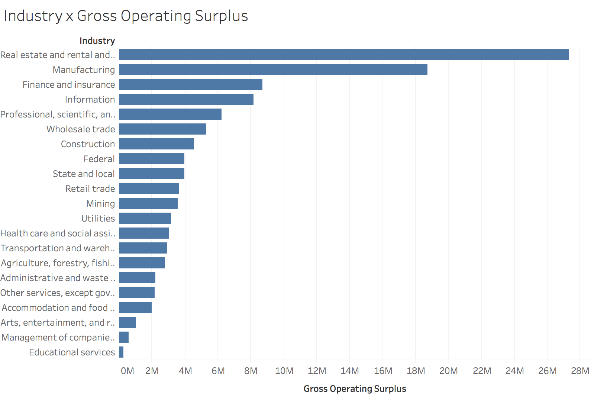
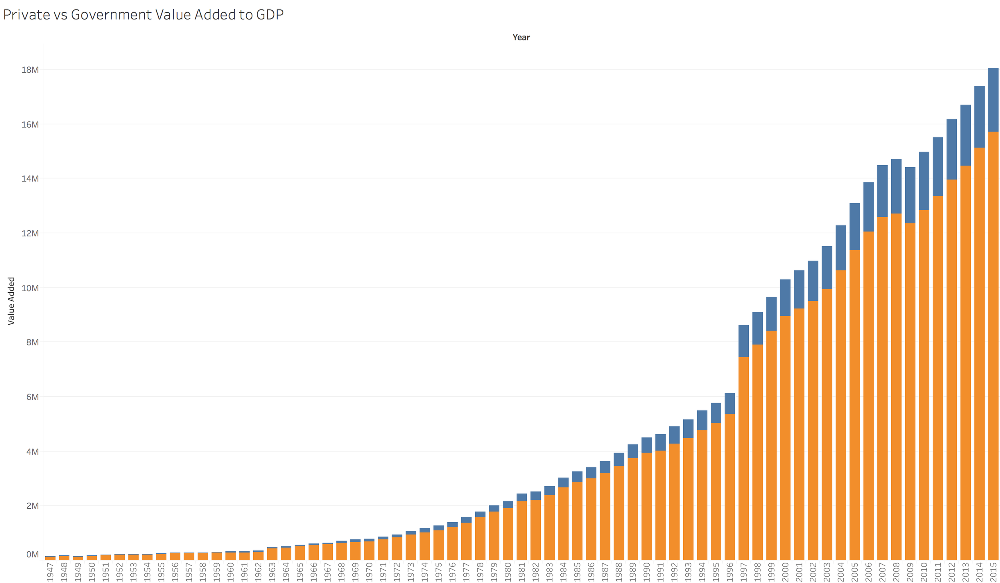

## U.S. Gross Domestic Product Analysis USING ML

### About

I conducted an analysis of U.S. Gross Domestic Product and its components from 1947 until present, to identify trends and confirm or dispel popular notions about the economy. GDP components such as compensation, taxes, gross operating surplus, and intermediate inputs (capital, labor, energy, materials, and services) were all analyzed.

### methods

Data was obtained from the Bureau of Economic Analysis, and cleaned and converted using Excel. It was then processed by a custom R script to reshape and melt into a machine-readable table. Additional R scripts were written to perform machine learning (ML) using hierarchical cluster analysis and visualization. (Sample visualizations shown on this page indicate the type of charts generated.)

