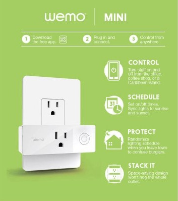
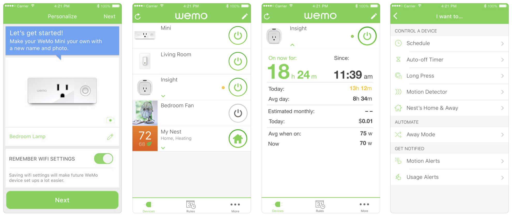
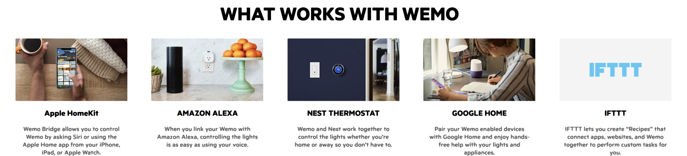

## Wemo Smart Home PRODUCTS

[Wemo](http://www.wemo.com/) encompasses a line of smart home products that range from smart plugs to light switches and dimmers. These products are controlled through the Wemo app and can be integrated with [partners](http://www.wemo.com/works-with-wemo/) like Amazon Alexa, Google Home, Apple HomeKit, Nest, and IFTTT. Devices can be set on timers and schedulers, and some can provide real-time feedback on energy usage.

The Wemo smart plugs have been rated by the New York Times Wirecutter as the [best plug-in smart outlet](https://thewirecutter.com/reviews/best-smart-switch/), the Editor's Choice-winning best smart plug of 2018 by PC Magazine, and cited as "the secret to a seamless smart home" by [CNET](https://www.cnet.com/news/these-smart-plugs-are-the-secret-to-a-seamless-smart-home/).

I supported Wemo hardware and software through mixed-methods design research, applying qualitative and quantitative methods to uncover our users' needs, values, and behaviors. I served as the voice of our user — advocating for their experience when delivering findings and recommendations to a cross-functional product development group.

I managed a variety of research projects end-to-end, with methods such as data analytics, surveys, interviews, card sorting, paper-prototype testing, competitive analysis, and in-person weekly rapid, iterative usability testing, in addition to larger summative and benchmark testing. I also led an internal study on our company’s software design and development process. Lastly, I helped roadmap the company's long-term UX research agenda. 

